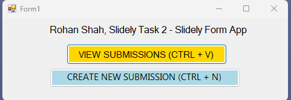
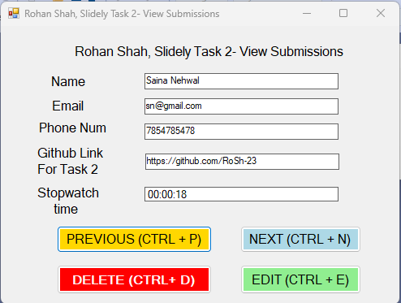
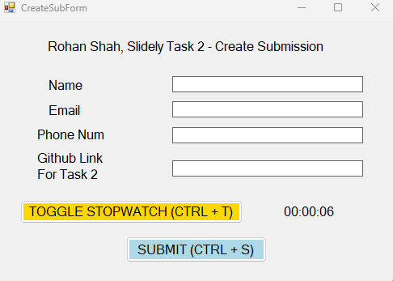

# Slidely AI WinForms Code

##  Candidate Info
+ Name: Rohan Shah
+ Email: shah_rohan2001@yahoo.com

## About
Hi Slidely team, this repository contains my code for the WinForms part of the task 2.

## Technical Description
+ Language: VB.NET
+ Packages: Newtonsoft.Json version=13.0.3
+ Tool: Visual Studio - 2019 Version
+ .NET Version: 4.5

## How to Run
- Go to Visual Studio
- Click on Clone a Repository
    - Enter the https url of this repo: https://github.com/RoSh-23/SlidelyAI_Task2_Winforms_Code.git
- Install the Newtonsoft.json package if required
- Run the Slidely_AI_Task_2_Google_Forms.sln solution file

## Points to remember
1. In the submission form for new records some fields are being validated using regexes, you will be prompted when entering invalid data regarding the valid format but still explaining here:
    - Name: not longer than 60 characters
    - Email: valid email format, follow the regex "^[A-Z0-9._%+-]{1,64}@(?:[A-Z0-9-]{1,63}\.){1,125}[A-Z]{2,63}$"
    - Phone Num: Indian mobile numbers, starting from 6,7,8,9 and 10 digit long.
    - Github Link: Should start with https://github.com/
2. All the keyboard shortcuts work.
3. When using CTRL + T for toggling the stopwatch, a bell sound comes which I was not able to remove, but it still works.
4. Editable fields are name, email, phone num and github link, the stopwatch time is not editable.

## Description/Features
1. Tried to use exception handling as and when required.
2. Features:
    + Compulsory:
        - View submissions
        - Create new submission
        - stopwatch toggle and not reset
        - shortcuts
    + Optional:
        - edit submission
        - delete submission

## Screenshots

